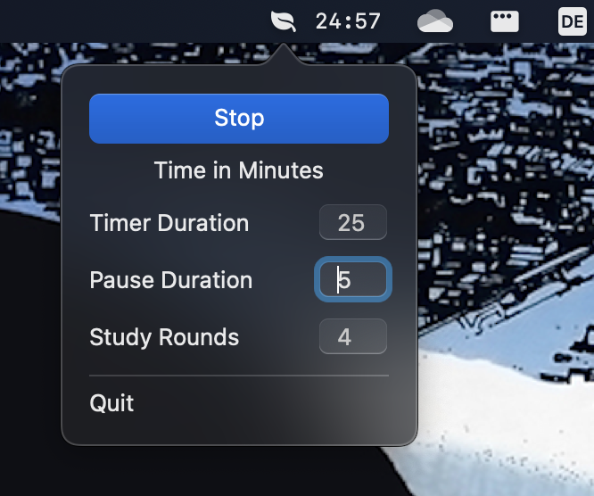

# Domates
Domates (turkish for Tomato) is a MenuBar Pomodoro Timer for MacOS
written in Swift.

# Functionality
Basic Pomodoro Timer with adjustable study,pause durations and adjustable round count

# Planned
- Pausing
- Short and Long Pauses

